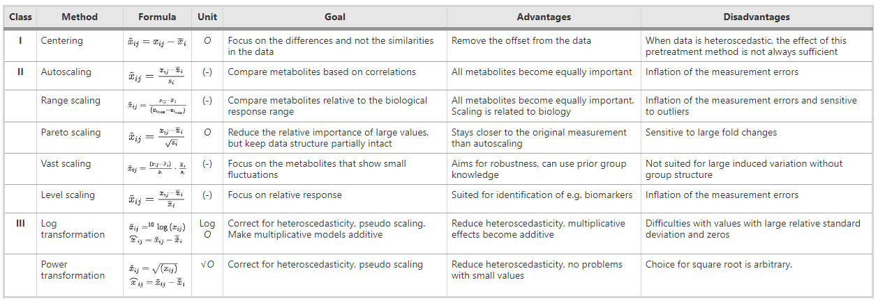
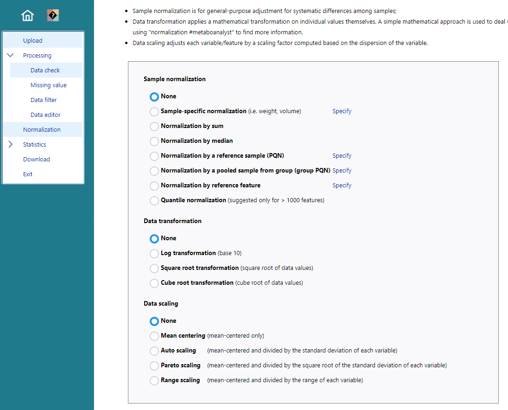
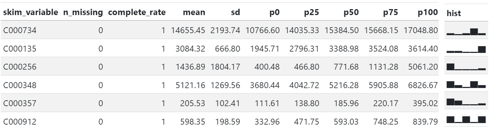
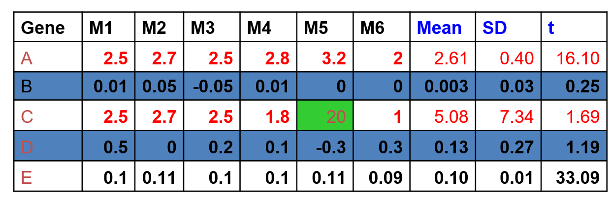
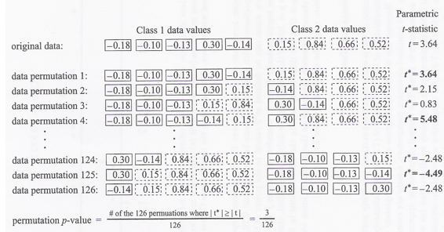

<style type="text/css">
.remark-slide-content {
    font-size: 22px;
    padding: 1em 4em 1em 4em;
}
.left-code {
  color: #777;
  width: 38%;
  height: 92%;
  float: left;
}
.right-plot {
  width: 60%;
  float: right;
  padding-left: 1%;
}
</style>

```{r setup, include=FALSE}
options(htmltools.dir.version = FALSE, echo=FALSE,
        message=FALSE,warning=FALSE,
        fig.dim=c(4.8, 4.5), fig.retina=2, out.width="100%")

knitr::opts_chunk$set(echo = FALSE)

knitr::knit_hooks$set(mysize = function(before, options, envir) {
  if (before) 
    return(options$size)
})
```

# Outline

.columnwide[
  ### 1) Introduction
  ### 2) Data preprocessing
  ### 3) Exploratory Analysis
  ### 4) On tests and P-values
  ### 5) The multiple testing problem
  ### 6) Summary and Conclusions
  ### 7) References and Resources
]

---

class: inverse, middle, center

name: Introduction

# Introduction and motivation

---

# Where we come from

```{r out.width="80%", fig.cap='From spectra and images to data tables'}

```

---

# Where we are heading

```{r out.width="80%", fig.align='center', fig.cap='Making sense of the data with Statistical and Bioinformatical methods and tools.'}

```

---

# Learning objectives

- Familiarise with the *omics data analysis process*

- Refresh Statistics backgrounders. 

  - Emphasize relevant aspects of tests (p-values, multiple tests)

- Learn about distinct approaches 
  - Description/Modelling, 
  - Univariate/Multivariate  
  - Statistics/Machine Learning

- Exploratory Unsupervised Statistical Methods 

- Supervised Statistical and ML methods 


---

# The Omics Data Analysis Process

```{r out.width="90%", fig.align='center', fig.cap='Omics technologies may differ in their data generation processes as well in the questions they aim at answering. The general steps, however, show common traits among technologies.'}

```

---

# The Statistical Analysis Process

```{r out.width="85%", fig.align='center', fig.cap='Superimposed to the Omics Process there are a series of exploratory and modeling steps that, altogether, form the Statistical Analysis Process.'}

```

---

# The Data for the Analysis

- At the end of the data generation process we end up with similar types of data such as *Peak intensities, Concentrations*, usually organized in some type of rectangular  *features* $\times$ *samples* tables.

- These are, somehow, linked, to complementary information  (sample groups, metabolite names ...), generally kown as the study *metadata*.


```{r out.width="60%", fig.align='center', fig.cap='A possible organization of data and metadata using an Excel spreadsheet'}

```

---

# Metadata organization

- Typically *metadata* is intended to provide information on:
  - Samples characteristics or experimental groups
  - Variable names and other characteristics (e.g. is a metabolite *endogene* or *exogene*)
  - Study characteristic such as the platform, technology or other data generation characteristics.

```{r out.width="80%", fig.align='center', fig.cap='Metadata can be provided as separate pieces of information.'}

```

---

# Metadata management

- Some software libraries like [Bioconductor](http://bioconductor.org) provide specific  structures to allow the integrated management of data and metadata.
- This is a powerful approach, but requires some level of expertise and is far from being universally adopted.

```{r out.width="45%", fig.align='center', fig.cap=''}

```

---

# Metadata integrated with data

- Metadata can be combined with features values in the same file. 
- This simplifies data management, but may have a poorer metadata

```{r out.width="95%", fig.align='center', fig.cap=''}

```

---

# Omics data structure

- As with many other OMICS, Metabol*omics* data are high throughput. 
- This, in practice, means often having more variables than samples.
- It also imposes some restrictions to the analysis methods that can be used on the data.

```{r out.width="70%", fig.align='center', fig.cap='Traditional datasets (left) have more samples (K) than variables (N), while omics datasets (right) may have more features than samples (K >> N)'}

```

---


class: inverse, middle, center

name: DataPreprocessing

# Data pre-processing


---

# Data may not be that good

- Omics data are high throughput which, in practice, means there is a huge number of values to deal with.

- These values may be affected by the process that has generated them, which may have experienced unexpected issues.

- Even if nothing went wrong there may be **noise**, some values may be **missing**, others may be unexpectedly big or small (**outliers**).

---

# Quality control and preprocessing

.pull-left[

- The data usually undergo a series of iterative steps where they are 
  - checked, 
  - eventually adjusted to correct some detcted problem and
  - re-checked to find out if the problem has been corrected.


- Here we don't go into pre-processing details, because they are discussed elsewhere.
- We only consider them in what they may affect statistical analysis.

]

.pull-right[

```{r out.width="100%", fig.align='center', fig.cap=''}
# 

```
]


---

# Missing values (MV)

.pull-left[

- Due to either signal truncation, failures in peak detection or true missings.

- Can lead to biased results, reduced statistical power, and invalid conclusions.

- MV are usually imputed as mean/mode imputation, k-nearest neighbors, or multiple imputation techniques.

- Failure to address can distort parameter estimates and increase type I/II errors. 
]

.pull-right[

```{r out.width="100%", fig.align='center', fig.cap='Source: https://doi.org/10.1007/s11306-011-0366-4'}
# 

```
]

---

# Outlier Detection (OD)

.pull-left[

- Extreme values that don't seem to fit with the data
- Can skew results, affect mean/variance, and lead to misleading inferences.
- Detection through variability measures in normal or reduced dimensions.
- Treatment: remove, adjust, or analyze separately.
-  Ignoring outliers can result in inflated errors and biased parameter estimates.
]

.pull-right[

```{r out.width="100%", fig.align='center', fig.cap='Univariate vs bivariate outlier detection'}

```
]


---

# Sample Normalization (SN)

.pull-left[

- Variation in data acquisition can introduce systematic biases, affecting comparability across samples.

- Normalization aim at making samples comparable while keeping the ability to detect eventual differences

- Many methods exist from simple median normalization to many elaborate approaches.

]

.pull-right[
<br>

```{r out.width="100%", fig.align='center', fig.cap=''}

```

Source: [Data normalization strategies in metabolomics](https://doi.org/10.1177/1469066720918446)
]

---

# Evaluate normalization effects

.pull-left[

- How can we know that normalization has produced the expected effect?

- Distinct criteria may lead to distinct choices but

- It is always a good idea to try to evaluate how well does any preprocessing method.

]

.pull-right[

```{r out.width="100%", fig.align='center', fig.cap=''}

```

Source: [NOREVA: normalization and evaluation of MS-based metabolomics data](https://www.ncbi.nlm.nih.gov/pmc/articles/PMC5570188/)
]

---


# Data Transformations

.pull-left[

- Data may be skewed and/or heteroscedastic, violating certain test assumptions.

- Normalizing transformations (log, sqrt, etc.) may stabilize variance and approach normality.

- Proper transformation ensures that statistical assumptions are met, enhancing the validity of inferential statistics.

]

.pull-right[
<br>

```{r out.width="100%", fig.align='center', fig.cap=''}

```

Source: [Adaptive Box–Cox Transformation ... for Better Statistical Analysis](https://pubs.acs.org/doi/pdf/10.1021/acs.analchem.2c00503)
]

---

# Scaling

.pull-left[

- Data with different ranges and units, cause high-variance metabolites to dominate multivariate analyses.

- Solved by scaling  the data using standardization (z-score) or unit variance scaling.

- Without scaling, statistical methods like PCA or clustering may be biased towards high-variance features, misrepresenting the true data structure. 
]

.pull-right[

```{r out.width="90%", fig.align='center', fig.cap=''}

```

Source: [ Centering, scaling, and transformations: improving the biological information content of metabolomics data](https://bmcgenomics.biomedcentral.com/articles/10.1186/1471-2164-7-142/tables/1)

]

---

# Centering, Scaling, Transformations

```{r out.width="100%", fig.align='center', fig.cap=''}

```

Source: [ Centering, scaling, and transformations: improving the biological information content of metabolomics data](https://bmcgenomics.biomedcentral.com/articles/10.1186/1471-2164-7-142/tables/1)

---

# In practice ... (MetaboAnalyst)

```{r out.width="60%", fig.align='center', fig.cap=''}

```

---

# Preprocessing in summary

.pull-left[

- The output of preprocessing steps is a cleaner, more homogeneous dataset.

- This does not necessarily mean this is a better dataset!

- Steps should not be taken blindly, but carefully
  - Their need and their effect must be assessed.
  - When in doubt, leave things unchanged.
  - Or ask your favourite bioinformatician.
]

.pull-right[

```{r out.width="80%", fig.align='center', fig.cap=''}

```

Source: [Metabolomics Data Normalization with EigenMS](https://journals.plos.org/plosone/article?id=10.1371/journal.pone.0116221)
]

---

class: inverse, middle, center

name: ExploratoryAnalysis

# Exploratory Analysis

---

# Exploratory Data Analysis (EDA)

.pull-left[

- It refers to any calculation or figure that provides information about a dataset.

- The first thing (sometimes the only thing) to do in a Data Analysis.

- It impregnates every step in the omics data analysis process
  - Quality checks
  - Data exploration
  - Statistical test (check asumptions, visualize results)
  - Statistical modeling (check assumptions, visualize model fit)

]

.pull-right[

```{r out.width="80%", fig.align='center', fig.cap=''}

```
]

---

# Univariate vs Multivariate EDA

.pull-left[

- Omics data are high dimensional (multivariate): 1 dimension/feature.

- Features are related to each other.

- This leads to consider multivariate statistics as the natural way to try to understand data structure
  - The relation between features.
  - The similarity between individuals.

- This is may be complex and not necessarily informative.
  - It is usually complemented by uni and bi-variate exploration
]

.pull-right[
```{r out.width="30%", fig.align='center', fig.cap=''}

```
]

---

# Initial Data Examination

.pull-left[
- Start any statistical analysis by looking at the data

  - [Which/How many/What type of] variables, 

  - [Which/How many] samples
  
  - Are there some/many missing values?
  
- Obtain simple summary statistics and plots

-  Visualize the data, try to get a grasp of variables and individuals

]
.pull-right[

```{r out.width="60%", fig.align='center', fig.cap=''}

```

]

---

# Numerical summaries

- If the number of features is not huge, they provide useful information

- Location estimates: Mean, Median, Mode, quantiles

- Dispersion estimates: Variance, Standard deviation, interquartile range

- For relation between variables we can estimate the covariance between two variables which measures their degree of linear association.
- Covariance depends on the units of the variables. 
  - Use the correlation coefficent to have a unitless scale.
  - Always consider Pearson and Spearman (Ranks) coefficient.
  
- Other measures are also useful, but less used
  - E.g. Skewness is a measure of the simmetry of the variable. Values outside [-1, +1] suggest skewed distributions.
  
---

# A toy dataset

```{r out.width="90%", fig.align='center', fig.cap=''}

```

---

# Numerical summaries
  
```{r out.width="80%", fig.align='center', fig.cap=''}

```


---

# Don't confuse features with observations!


- In classical statistics we always think of summarizing or plotting variables.
- In omics data it is common to summarize/plot samples
  - It can be done, it may be useful
  - But it does not mean the same.


- The lines below show the mean an sd of each sample

- The columns on the right show the mean an sd of each variable.

- They are different. They don't mean the same!

```{r out.width="60%", fig.align='center', fig.cap=''}

```

---

# The *king* of graphical summaries

- Boxplots provide a condensed representation of a distribution, based on quartiles and outliers.

- Being a flat representation, it facilitates comparisons.

```{r out.width="100%", fig.align='center', fig.cap=''}

```

---

# Again, they are not the same!

```{r out.width="90%", fig.align='center', fig.cap=''}

```

---

# From uni/bivariate to multivariate EDA

- Omics data are high dimensional
- Because of this, it makes full sense to try to look *at all variables at once*
- Although possible in moderate settings, it is generally very difficult to extract useful information.
- An alternative is to rely on dimension reduction methods, that retain some/most information and project it to lower dimensional spaces where this can be visualized.

- For this, we will go through a series of Multivariate Exploratory (Unsupervised) techniques.


---

class: inverse, middle, center

name: StatisticalTests
  
# On tests and p-values

---
                                    
# The *Class comparison* problem 

- Main goal: Identifying  significantly different features

- Identify features whose values are (significantly)
    associated with different conditions
     - Treatment, cell type,... (qualitative covariates)
     - Dose, time, ... (quantitative covariate)
     - Survival, infection time,... !
     
-   Estimate effects/differences between groups,

  - either directly: $D = Y - X$ or
  - in a log scale (using ratios): $log(X)-log(Y) = log(X/Y)$.

---

# What is a “significant change”?

.pull-left[

- Depends on the variability
    within groups.
    
- Variability, of course,  may be
    different from feature to
    feature.
    
-   To assess the statistical
    significance of observed differences,
    a statistical test is usually condected *for
    each feature*.
    
- There also exist multivariate tests to make all comparisons at one, but the nature of the data usually makes them unfeasible.
]

.pull-right[


]


---

# Different settings for statistical tests (1)

**Indirect comparisons**
  
- Two (or more) groups, unpaired samples
  
- Example:  **10** individuals: 5 suffer diabetes, 5 healthy

  - One sample for each individual
  
  - Typically: Two sample t-test or similar


```{r out.width="70%", fig.cap=''}

```        


---

# Different settings for statistical tests (2)
    
**Direct comparisons:** 
   
- Two groups, **paired samples**

- Example: 6 individuals with brain stroke.
  
  - Two samples from each: one from healthy (region 1) and one
      from affected (region 2). That is a total of 2*6 = 12 samples
  -   Typically: One sample t-test (also called paired t-test) or similar, based on the individual differences between         conditions.

```{r out.width="70%", fig.cap=''}

```  

---

#   Some issues in feature selection

- Each technology’s data may have peculiarities that
  have to be dealt with.
- Some related with small sample sizes
   -   Variance unstability
   -   Non-normality of the data
- Other related to big number of variables
   -   Multiple testing


---

# Variance unstability

- Can we trust average effect sizes (average
      difference of means) alone?
-     Can we trust the t-statistic alone?
-     Here is evidence that the answer is no.


```{r out.width="80%", fig.cap=''}

```  


---

# Variance unstability (1): outliers
 - Can we trust average effect sizes (average
      difference of means) alone?
 -    Can we trust the t statistic alone?
 -    Here is evidence that the answer is no.
 

```{r out.width="80%", fig.cap='Averages can be driven by outliers'}

```


---

# Variance unstability (2): tiny variances
- Can we trust average effect sizes (average
       difference of means) alone?
-      Can we trust the t statistic alone?
-      Here is evidence that the answer is no.

```{r out.width="80%", fig.cap='t-values can be driven by tiny variances'}


```

---

#  Solutions: Adapt t-tests

.pull-left[

- A standard solution: Combine

  - Local estimates of variability, $SE_g$ (based on individual features)
  
  - With global estimates, $SE$, (based on all features together)
  
- This results in *moderated estimators* that account simultaneosuly for
  - The variability of individual features
  - And that of all features together.
  
]

.pull-right[

```{r out.width="100%", fig.cap=''}

```
]

---

# Up to here…: 

- Can we generate a list of candidate features?
- With the tools we have, the reasonable steps to generate a list of candidate features may be:

```{r out.width="80%", fig.cap=''}

```
- We need to be able to figure how significant are these values.
- Traditional, somehow polemic, approach: 
  - Assign them p-values
  - Use these to select those features to be retained (* But see later*)

                                                                  ---
                                                                 # Nominal p-values
                                                                                 
- After a test statistic is computed, it is convenient to convert it to
   a p-value:

- It is defined as *The probability that a test statistic, say $S(X)$, takes values equal or greater than the observed value, say $X_0$, under the assumption that the null hypothesis is true
$$
                p=P\{S(X)>=S(X_0)|H_0 \mbox{ true}\}
$$

---

# Significance testing

- Test of significance at the $\alpha$ level:

  - Reject the null hypothesis if your p-value is smaller
    than the significance level
  - It has advantages but not free from criticisms
  
- Features with p-values falling below a prescribed
  level may be regarded as significant
  
- As we know, depending on what the truth is this can lead to

  - Two type of correct decisions
  
  - Two possible types of errors

---

#  Hypothesis testing overview

```{r out.width="100%", fig.cap=''}

```

---

#   Calculation of p-values (1)

- Standard methods for calculating p-values is to use tabulated p-values *for the distribution that the test statistic is assumed to follow*.

- This, however, maybe harder to check than one would expect.

  - In the toy dataset, where each variable has onle 6 observations the normality assumption is impossible to check!
  
  - If sample size is bigger it may be possible to do some goodness of fit test, but, it should be done carefully and for all features in the dataset.
  
- This kind of checks are usually omitted and the *validity conditions are assumed to be true*

  - For some distributions, where there is robustness to departure of assumptions, it may work in a wide range of conditions.
  
  - It may be a good idea to look for alternatives.
  
  
---

# Calculation of p-values (2) Permutations tests

- Permutation tests are a good alternative to parametric, or even non-parametric tests.

- Based on data shuffling. No assumptions (only *exchangeability* is required.)

- Relatively simple to understand and implement. They are based on
  - Random interchange of labels between samples
  - Estimate p-values is based on the approximate permutation distribution of the test statistic.
  
---

# Permutation tests algorithm
  
- Repeat, for each feature $\mathbf{xi},\, i=1,...N$:
  - For every possible permutation $1,...B$ of its observations
    - Permute the $n$ data points for that feature. 
    - Design first $n_1$ as "treatments", the second $n_2$ as "controls"
    - Calculate the corresponding two sample test statistic, $t_b$
- After all the B permutations are done approximete the $p$-value by:

$$p =\frac{\# bº,:\, |t_b| ≥ |t_{observed}|}{B}$$

- Notice that **all these steps have to be performed for all features**, 
- that is, permutation tests are *computationally intensive*!

---

# Permutation tests (2)

```{r out.width="100%", fig.cap=''}

```

---

#  The volcano plot: fold change vs -log(pvalue)

```{r out.width="100%", fig.cap=''}

```


---

class: inverse, middle, center

name: MultipleTesting

# Multiple testing
  
---

#    The Multiple Testing problem

- Whatever approach we use to detect significant differences in features there is a common characteristic: 

- *Every test is applied to every feature set in a long collection of features*

- This leads to a *multiple testing problem*: 

  - As the number of tests increases
  
  - The probability of observing at least one false positive is also going to increase
  
- In order to avoid an artificial inflation of *False positive discoveries* some adjustment (also called "corrections") are recommended.


---

# Why multiple testing matters in omics

- The probability of observing one false positive if testing once is:

  - P(Making a type I error) = $\alpha$
  - P(not making a type I error) =  $1-\alpha$

- Now imagine we perform m tests independently
  - P(not making a type I error in $m$ tests) =  $(1-\alpha)^m$
  - P(making at least a type I error in $m$ tests) = $1-(1-\alpha)^m$
  
As $m$ increases the probability of having at least one type error tends to increase

---

# Type I error is not useful in omics


---

# How can we deal with this issue?

- Controlling for type I error is not feasible if many tests.

- There are distinct strategies to deal with it:

  1. *Extend the idea of type I error*: FWER and FDR are two extensions that , somehow, modify the error rate with the aim aof providing a "global" control of error probability.
    
  2. *Look for procedures that control the probability of error for these extended error types*: Mainly, this means adjusting raw p-values.


- AN ANALOGY: Indiana Jone's bridge

  - *Would you cross a bridge once if the probability that it broke down is 0.001?*
  - *Would you cross it 10.000 times?*
  - *What would you do if you decided not to cross that bridge?* 

---

# Error rate extensions and p-value adjustments

- Family Wise Error Rate (FWER)

  - FWER is the probability of observing, at least, one false positive

- False Discovery Rate (FDR)

  - False Discovery Rate is the *expected value of proportion of false positives* among rejected null hypotheses.
  
- Each type of error rate can be associated with distinct types of p-value adjustments

  - Bonferroni method  is used to provide control of  FWER
  
  - Benjamini-Hochberg (q-value) is used to provide control of  FDR.

---

# Difference between FWER and FDR

- FWER Controls for no (0) false positives
  - Controlling FWER yields fewer features (false positives), 
  - but you are likely to miss many.
- FWR is adequate if goal is to identify few features that differ between two groups.

- FDR Controls the proportion of false positives
  - If you can tolerate more false positives 
  - you will get many fewer false negatives
- Adequate if goal is to pursue the study e.g. to determine functional relationships among features.

---

# Steps to generate a list of candidate features  (2)

```{r out.width="90%", fig.cap=''}

```

---
# An example

- A list of 63 potentially significant p-values has been adjuested using Bonferroni and BH

- BH is clearly more restrictive than BH, which, however is more restrictive than the raw p-values.


```{r echo=FALSE}
cachexia.t_test <- read.csv("datasets/cachexia-t_test_all.csv", row.names=1)
rawPs <- cachexia.t_test$p.value
names(rawPs) <- row.names(cachexia.t_test)
bonfP <- p.adjust(rawPs, method= c("bonferroni"))
bhP <-  p.adjust(rawPs, method= c("BH"))
pVals <-data.frame(raw = rawPs, Bonferroni=bonfP, FDR = bhP)
Ordered <-round(pVals[order(pVals$raw),] ,6)
```

<small>
.pull-left[
```{r echo=FALSE}
kableExtra::kable(Ordered[1:8,])

```

P-values at the top of the table
]

.pull-right[
```{r echo=FALSE}
  kableExtra::kable(Ordered[41:48,])
```
P-values at the bottom of the table
]

</small>

<!-- --- -->

<!-- class: inverse, middle, center -->

<!-- name: Resources -->
  
<!-- # References and Resources -->

<!-- --- -->

