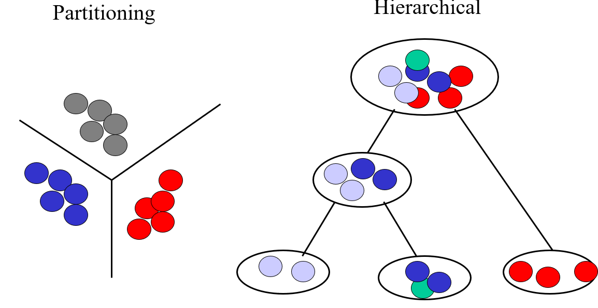

<style type="text/css">
.remark-slide-content {
    font-size: 22px;
    padding: 1em 4em 1em 4em;
}
.left-code {
  color: #777;
  width: 38%;
  height: 92%;
  float: left;
}
.right-plot {
  width: 60%;
  float: right;
  padding-left: 1%;
}
</style>

```{r setup, include=FALSE}
options(htmltools.dir.version = FALSE, echo=FALSE,
        message=FALSE,warning=FALSE,
        fig.dim=c(4.8, 4.5), fig.retina=2, out.width="100%")

knitr::opts_chunk$set(echo = FALSE)

knitr::knit_hooks$set(mysize = function(before, options, envir) {
  if (before) 
    return(options$size)
})
```


# Outline

.columnwide[
  ### 1) Introduction
  ### 2) Class Discovery (clustering)
  ### 3) Dimension Reduction (PCA)
  ### 4) Predictive modeling
  ### 5) Other Approaches
  ### 6) Performance Assessment
  ### ) References and Resources
]

---

class: inverse, middle, center

name: Introduction

# Introduction and motivation

---

# Omics data are high dimensional

- So far, our analyses are dealing with a single variable (i.e. univariate analysis)

  - T-tests: one variable, two groups
  - ANOVA: one variable, > 2 groups
  
- Even when we analyze many variables, we proceed *one at a time*
  - Determine how to analyze one single variable separatedly
  - Apply the procedure to all variables, 
  - Perform multiple test adjustment
  
- This is not wrong, but, at least it can be criticized because interactions (correlations) are missed.

- Even if we attempt to account for interactions, visualization are limited to three dimensions.

- So the question arises of __*How can we analyze & visualize high-dimensional data in a global ("holistic") way, that is considering all data together?*__

---

# The analysis of high dimensional data

- The classical approach to analyzing high dimensional data is Multivariate Statistics which orginates in the early 20th century.
  - Pearson 1901, Hottelling 1933: Principal Components Analysis
  - TW Anderson (1958): First Multivariate Statistics (as we know today) book
  
- Although classical MV Statistics considered Exploratory Analysis it was strongly rooted in Statistical Modelling and Distribution theory.

- By the end of the 20th century, as computing power became available and data did not stop growing many aspects of multivariate statistics were re-casted from the side of computer science
  - Their approach was not so much in modelling multivariate distributions but on the algorithms.
  
- The underlying idea of this *Machine Learning* approach is that instead of focussing on a model, we focus on howw to build an algorithm to solve a certain problem given a set of of examples.

- This lead to the idea of *Learning from Data*

---

# Machine learning and Statistics

```{r out.width="100%", fig.align='center', fig.cap=''}
knitr::include_graphics("images/2-MultivariateStat-and-ML_insertimage_1.png")
```

---

# More actors in the field

```{r out.width="100%", fig.align='center', fig.cap=''}
knitr::include_graphics("images/2-MultivariateStat-and-ML_insertimage_2.png")
```

---

# In any case, what do we need it for?


```{r out.width="100%", fig.align='center', fig.cap=''}

```

---

# Types of (multivariate) problems

-**Class discovery (Unsupervised learning)**
  - Goal: explore the data to find some intrinsic structures in them
    - Disregard whether they are related to the class labels or not) 
    - These patterns can be used to understand the key information within the data itself 
  - Methods: Clustering / Principal Components

  
- **Class prediction / Predictive modelling**
  - Goal: discover patterns in the data that relate data attributes with related to a target (categorical or numerical) attribute. 
   - These patterns can be utilized to predict the values of the target attribute in future data instances.
  - Methods: Regresion(s), Classification

---

class: inverse, middle, center

name: Unsupervised
  
# Unsupervised methods (1) : Clustering

---


# Discovering Groups in Data

.pull-left[

-   Clustering techniques allow for the identification of patterns and structures in data.

-   They work by partition the data space in regions where the data are more similar within each region than among regions.

- Many methods and approaches. Here we only consider:

  - Hierarchichal clustering 
  - K-Means, a partiive algorith
]

.pull-right[

```{r out.width="100%", fig.align='center', fig.cap=''}


```

]

---
# The components of clustering

- There are many clustering methods and algorithms but they all have a common goal: *Try to put togeher objects that are logically similar in characteristics*

- Cluster analysis is based on two main ingredients:

  - A *Distance measure*: to quantify the (dis)similarity of objects.
      - Notice we need to be able to measure the distance between individuals, but also between clusters.
  
  - *Cluster algorithm*: A procedure to group objects. Aim: small within-cluster distances, large between-cluster distances.

---
# What distance to use?

.pull-left[

```{r out.width="100%", fig.align='center', fig.cap=''}
knitr::include_graphics("images/2-MultivariateStat-and-ML_insertimage_8.png")
```


```{r out.width="60%", fig.align='center', fig.cap=''}
knitr::include_graphics("images/2-MultivariateStat-and-ML_insertimage_9.png")
```
]

.pull-right[

- Base the choice of distance in:
  - the application area
  -  your understanding of what sort of similarities you wish to detect?

- Correlation distance dc measures trends or relative differences.
- Euclidean and Manhattan distance both measure absolute differences between vectors.
- Manhattan distance is more robust against outliers.
- After standardization, Euclidean and correlation distance are equivalent

]
---

# Hierarchichal clustering

.pull-left[

- Hierarchical Clustring Analysis (HCA) seeks to build a hierarchy of clusters by iteratively grouping/splitting groups by their similarity.

- The result of HCA is a tree-based representation of the objects, which is also known as *dendrogram.* 

- Observations can be subdivided into groups by *cutting the dendrogram at a desired similarity level*.

- HCA avoid specifying the number of clusters by providing a partition for each k obtained from cutting the tree at some level.
]


.pull-right[


]

---

# Strategies for Hierarchical clustering

.pull-left[
They generally fall into two categories: 

- *Agglomerative*

  - This is a "bottom-up" approach: 
  - Each observation starts in its own cluster, and 
  - Pairs of clusters are merged as one moves up the hierarchy.

- *Divisive*: 
   - This is a "top-down" approach: 
    - All observations start in one cluster, and 
    - Splits are performed recursively as one moves down the hierarchy.

]

.pull-right[

```{r out.width="90%", fig.align='center', fig.cap=''}
knitr::include_graphics("images/2-MultivariateStat-and-ML_insertimage_10.png")
```
```{r out.width="90%", fig.align='center', fig.cap=''}
knitr::include_graphics("images/2-MultivariateStat-and-ML_insertimage_11.png")
```


Source: [Hierarchichal clustering in R](https://www.datanovia.com/en/courses/hierarchical-clustering-in-r-the-essentials/)

]

---

# Partitioning Methods

- These algorithms partition the data into a **pre-specified** number, $k$, of mutually exclusive and exhaustive groups.
- They work by iteratively reallocating the observations to clusters 
until some criterion is met, 
  - For example until "within cluster sums of squares" is minimized.

- Some Partitioning methods are:
  - k-means, 
  - Partitioning Around Medoids, PAM.
  - Self-organizing maps (SOM)
  - Fuzzy clustering which needs to have un underlying stochastic model, e.g. Gaussian mixtures.

---

# The K-means algorithm

.pull-left[

1. Randomly chooses $k$ observations from the dataset and uses these as the initial means.
2. For the next object calculate the similarity to each existing centroid.
3. If the similarity is greater than a threshold add the object to the existing cluster and re-compute the centroid, else use the object to start new cluster
4. Return to step 2 and repeat until done
]

.pull-right[

```{r out.width="90%", fig.align='center', fig.cap=''}
knitr::include_graphics("images/kMeansIllustration.png")
```

]

---

# Other clustering related issues

- Selecting the number of clusters

  - Often an important issue. Needs to devote some time
  - There exist criteria such as "maximize average silhouette"
  
- Determining the validity of clusters

  - All cluster algorithms will yield clusters
  - Need some way to determine if *they are real*
  - Typical approximation: Use resampling to build multiple clusterings and check consistency.
  
  
---

class: inverse, middle, center

name: Factorizations

# Dimension Reduction


---

# Motivation for PCA

- High dimensional data consist of dataset with

  - many observations (samples, individuals ...)
  - many measurements (variables, features) performed on each sample.
  
- Although a priori it seems they must be informative this is not immediate because

  - The data may have structures that we don't see at first sight
  - The data may contain noise
  - Many variables may be correlated: they do not contribute as much as one might expect.
  
<!-- - Principal Component Analysis is a technique entitled to reveal hidden (latent) data structures by transforming the data into a new set of features (the "components") which -->
<!--   - Are independent from every each other -->
<!--   - It may suffice to take a few of these to have much information. Thaht's why we talo of dimension reduction. -->


---


# Principal Component Analysis

.pull-left[

-   Given a $KxN$ data matrix containing 
  - $K$ variables (probably correlated measurements) in 
  - $N$ samples (objects/individuals...)

-   Assuming $K < N$, PCA transforms the variables into $K$ new components that:

  -   Reflect the different sources of variability in the data, but

  -   Are not correlated, i.e., *each component represents a different source of variability,*
]

.pull-right[

```{r, fig.align='center', out.width='60%', fig.cap='', echo=FALSE}
knitr::include_graphics("images/AMV4Omics-Overview-EN_insertimage_1.png")
```
]
<!-- [Source](https://towardsdatascience.com/tidying-up-with-pca-an-introduction-to-principal-components-analysis-f876599af383) -->
<!-- ] -->

---

# Designed to Improve

.pull-left[

-   These new components are constructed in such a way that:

  - They are orthogonal (perpendicular) to each other
  - *They have decreasing explanatory power*: each component explains more (variance) than the next one.

-  I most cases, a few components (2 or 3) suffice to summarize most of the information contained in the original variables.

-  That is, one can use PCA values to obtain a decent representation in *reduced dimension*.
]

.pull-right[

This picture depicts how, after performing PCA and retining the two first components, almost no information is lost.
]
---

# PCA highlights latent information


.pull-left[

-   It is generally assumed that PCA can be the basis to
  - Highlight dominant latent structures in the data,
  - As well as revealing natural groups, like genotypes or metabotypes,
  - And alos non natural unexpected groupings, due to batch effect.
  
- The image on the right shows the aspect of a PCA plot of a dataset before and after performing a batch adjustment.
]

.pull-right[

```{r, fig.align='center', out.width='60%', fig.cap='', echo=FALSE}

```

]

---

# How does PCA work?	

- Let's assume a KxN data matrix of two correlated variables.

- Because the data is correlated, it is difficult to separate each source of variability

  - To obtain a new system of coordinates the following optimization problem is considered:
  
  - Searching, sequentially, for a transformation of the original matrix 
  - in which the resulting vectors are orthogonal two to two, that is, The new variables (new coordinate axes) are independent of each other.
  
- Notice that, what we are asking is that our variance-covariance matrix becomes diagonal, since 
  the covariance of independent variables is zero.
  
---

# Obtaining the PCs

- Under general conditions, the way to obtain a new coordinate system where the covariance matrix is diagonal can be obtained by *diagonalizing the variance-covariance matrix of the centered data*
  - Diagonalization is a calculation performed on a matrix that results in:
    - A vector of eigenvalues (VAPs) proportional to the variance of each variable in the new coordinates
    - A matrix of eigenvectors (VEPs) that are, precisely, the scores or scores of the observations in these new coordinates.

- This operation yields a new system of coordinates where
  - the covariances of the new variables become 0, that is, independent variables are obtained.
  - the eigenvalues (the diagonal of the new matrix) are ordered from highest to smallest, which corresponds to the idea that each one has a greater variability than the next ones.


---

# PCA in a nutshell


```{r, fig.align='center', out.width='70%', fig.cap='', echo=FALSE}

```

---

# Interpreting Principal Components

- The first main component is 
  
  - A linear combination (LC) of the original variables
  - That goes in the direction of greater variability in the data   
  - Explains the *maximum amount of variation* in the data
  
  
- The 2nd and successive PCs are also a LC of all the original variables, although with other coefficients calculated in such a way that:
  - It aligns with the next direction of greatest variability, orthogonally to the previous PCs.
  - Explain the maximum amount of *remaining variation*
  
- Sometimes interpretation of the new components may be clear, corresponding to real biological dimensions or, sometimes, not at all.

- To facilitate this, the correlation between components and the original variables is computed.


---

# Data visualization in the PCA space

- Scores  are the new coordinates in the orthogonal system defined by the PCs 
  
- They have been built so that 
  - the first PC explains the highest quantity of variability,
  - the second PC explains explains the highest quantity of remaining variability, and so on ...

- This means that it is not necessary to use all PCs to visualize the data in this new coordinate system, so a visualization can be made in a lower dimension.]

  -  Often, takin only the first 2 or 3 first PCs is enough, 

  - It should always be verified that this is the case

  - The "scree plot" graph together with a criterion of "change of slope" or elbow, are usually useful.


---

# Examples

- [PCA example in MetaboAnalystR](https://www.metaboanalyst.ca/resources/vignettes/Statistical_Analysis_Module.html)

- [FactoMineR Decathlon Tutorial](http://factominer.free.fr/factomethods/principal-components-analysis.html)

- [R tutorial: Principal Component Analysis with Metabolomics Data](https://juanpacarreon.com/posts/pca-matabolomics/)

---

class: inverse, middle, center

name: PredictiveModeling
  
# Predictive Modeling: regression and Relatives

---

# Why predictive modeling

- We are interested in $Y$, an informative quantity but difficult (or expensive, or slow) to measure, 

- If $Y$ is related to others, say $X_1, X_2, ...X_n$ that may be easier (faster, cheaper) to obtain, we may attempt
  
  1. To model the relation 
  $$
  Y= f(X_1, ..., X_n) + \epsilon
  $$
  2. Fit the model to obtain an approximation, $\hat f$, to $f$ or its parameters
  
  3. Use that approximation to predict the values of $Y$ for a set given certain values $x_1, ..., x_n$.
  
  $$
  \hat y = \hat f(x_1, ..., x_n) 
  $$
- The most common approach to model such relations is using *Regression models*

---

# The (multiple) linear regression model


- The relation between the response and the independent variable is assumed to be linear.

- Restrictive and very simple, but powerful when assumptions hold and the model is valid.

---

# Logistic regression

- If the response variable is dichotomous (yes/no) the MLR is not adequate.

- Logistic regression models the probabilities of a sample being a member of either of two groups for a set of predictors.


```{r, fig.align='center', out.width='60%', fig.cap='', echo=FALSE}
knitr::include_graphics("images/2-MultivariateStat-and-ML_insertimage_15.png")
```

- Notice that it is also a linear regression model where the response variable is the log odds.

---

# High dimensional data issues

Working with high dimensional data requires to account for a series of issues that may not be apparent in lower dimensions

- **Curse of Dimensionality:** High-dimensional spaces can dilute the signal, making it hard to distinguish between true signal and noise.
  
- **Computational Complexity:** Processing and analyzing high-dimensional data requires substantial computational resources.
  
- **Scalability:** Classical methods struggle to scale efficiently with increasing dimensionality.
  
- **Sparse Data:** High-dimensional data can lead to sparsity, making it challenging to detect meaningful patterns.

---

# Limitations of classical linear models

The high dimensionality of omics data usually determines that these models are not adequate due to a variety of reasons


  - **Overfitting:** High-dimensional data can lead to overfitting, where the model captures noise instead of the underlying pattern.
  
  - **Multicollinearity:** Metabolomics data often have highly correlated variables, causing instability in coefficient estimates.
  
  - **Feature Selection:** Requires manual or algorithmic feature selection, which can be computationally intensive and prone to bias.
  
  - **Interpretability:** Coefficients become harder to interpret with a large number of features.
  
  - **Class Imbalance:** Performance can be significantly affected if there is an imbalance in the class distribution.

---

# Alternatives for predictive models

- The fields of Statistics and Machine Learning have developed a long collection of alternatives.

- Each type of solution may be appropriate for one or more of the problems highlighted above.

  - Regularization Techniques
  - Dimension Reduction Techniques
  - Non linear methods
  - Ensemble methods
  - Machine learning methods
  - Sparse models
  - Neural networks
  
---

# Regularization Techniques

.pull-left[


- **Lasso Regression (L1):** Adds a penalty for the absolute value of coefficients to induce sparsity.

- **Ridge Regression (L2):** Adds a penalty for the square of coefficients to handle multicollinearity.

- **Elastic Net:** Combines L1 and L2 penalties to balance sparsity and multicollinearity handling.
]

.pull-right[


```{r, fig.align='center', out.width='90%', fig.cap='', echo=FALSE}

```

]

---

# Dimension Reduction Techniques

.pull-left[


- **Principal Component Analysis (PCA):** Reduces dimensionality by projecting data onto principal components.

- **Principal Component Regression (PCR):** Reduces dimensionality projecting independent variables (predictors)  onto principal components and fits a regression model to PCs.


- **Partial Least Squares (PLS):** Projects predictors and response variables onto a new space to maximize covariance.
]

.pull-right[


```{r, fig.align='center', out.width='90%', fig.cap='', echo=FALSE}

```

]

---

# Nonlinear Methods

.pull-left[


- **Kernel Methods:** Extend linear methods to nonlinear relationships using kernel functions.

- **Decision Trees:** Nonlinear models that split data based on feature values, leading to simple and interpretable predictive models.

]

.pull-right[

```{r, fig.align='center', out.width='90%', fig.cap='', echo=FALSE}

```

]

---


# Ensemble methods

.pull-left[


- **Bagging:** Ensemble method that handles high-dimensional data by averaging multiple decision trees built on bootstrap resamples of the original sample.

- **Random Forest:** Ensemble method that handles high-dimensional data by averaging multiple decision trees built on resamples, but also using random sets of features at each node.

- **Gradient Boosting Machines (GBM):** Builds an ensemble of weak learners to improve predictive performance.


]

.pull-right[


```{r, fig.align='center', out.width='90%', fig.cap='', echo=FALSE}

```


]


---


# Machine Learning Methods (SVMs)

.pull-left[

- **Support Vector Machine (SVM):**  
  
  - Find the hyperplane that best separates data points of different classes by maximizing the margin between them. 

  - They are effective in high-dimensional spaces and can handle nonlinear data using kernel functions. SVMs are robust to overfitting, especially in high-dimensional datasets.

]

.pull-right[

```{r, fig.align='center', out.width='90%', fig.cap='', echo=FALSE}

```


]


---

# Neural Networks

.pull-left[

- **Neural Networks** Deals with non-linear realtions in a black-box automatic approach.

- **Deep Learning:** Handles high-dimensional data with multiple layers of abstraction, especially useful with large datasets.

- **Autoencoders:** Unsupervised neural networks that learn efficient codings of input data for dimensionality reduction.
]

.pull-right[

```{r, fig.align='center', out.width='60%', fig.cap='', echo=FALSE}

```

]


---

# Other approaches 

## Sparse models


- **Sparse Partial Least Squares (sPLS):** Combines PLS with sparsity to handle high-dimensional data.

- **Sparse Logistic Regression:** Applies sparsity constraints to logistic regression for feature selection.

## Bayesian Methods

- **Bayesian Regression:** Incorporates prior information and deals with uncertainty in high-dimensional settings.

- **Bayesian Networks:** Models complex relationships between variables and handles high-dimensional data efficiently.

---

class: inverse, middle, center

name: PLS
  
# PLS and PLS-LDA

---

# Partial Least Squares 

- From all the presented alternatives, probably the best known, most used in chemometrics and metabolomics is PLS and PLS-LDA

- PLS appears as a natural alternative to MLR and PCR

  - **Multiple Linear Regression (MLR)**: MLR directly models the relationship between predictors and response variables but can suffer from multicollinearity and overfitting in high-dimensional data.

  - **Principal Component Regression (PCR)**: PCR first reduces the dimensionality of predictors using PCA and then applies MLR. However, PCA does not consider the response variable in the dimension reduction step.

  - **PLS vs. PCR**: PLS, unlike PCR, takes the response variable into account when determining the components, leading to better predictive performance when predictors are highly correlated.

---

# Interlude: Linear Discriminant Analysis

.pull-left[
- LDA is a classification technique, developed by R.A. Fisher used to find a linear combination of features that best separates two or more classes. 

- It works by maximizing the ratio of between-class variance to within-class variance, ensuring that the classes are as distinct as possible.
]

.pull-right[

]

---

#  Key Points of LDA

- LDA projects data onto a lower-dimensional space where the classes are well separated.

- It assumes that the features follow a Gaussian distribution and that each class has the same covariance matrix.

- LDA is *particularly usefu*l when the class separability is linear and the dimensionality of the data needs to be reduced for efficient computation and improved classification performance.

---

# Combining PLS and LDA

- PLS-LDA  is a classification technique that combines PLS for dimensionality reduction with LDA for classification.

- PLS-LDA uses PLS to reduce the dimensionality of the predictor variables while considering the response variable (class labels).

- After reducing the dimensionality, LDA is applied to classify the samples based on the new PLS components.

- PLS-LDA is effective for high-dimensional classification tasks, leveraging the strengths of both PLS in handling multicollinearity and LDA in classification.

---

class: inverse, middle, center

name: ClassPredictionProcess
  
# Performance assessment in class prediction

---

# Performance assessment

- The process of building and validating classifiers involves more than simply fitting a predictive model and performing the classification.

- Before using a classifier for prediction or prognostic one needs some performance measures

  - For instance the accuracy of a predictor is usually measured by the *missclassification rate*: The % of individuals belonging to a class which are erroneously assigned to another class by the predictor. 

- This is however more complicated than simply computing error rates because *we are not interested in the ability of the predictor for classifying  current samples*

  - One needs to estimate *future performance* based on what is available.
  
---

# Error rate estimation

- Using the same dataset on which we have built the predictor to estimate the missclassification rate may lead to erroneously low values due to overfitting.

  - This erroneous estimator is known as the *resubstitution estimator*.

- Ideally, we should use a *completely independent* dataset to evaluate the classifier, but it is rarely available.

- Usually alternatives approaches such as
  
  - Test set estimators
  
  - Cross-validation estimators


---

# Performance assesment (1)

- **Resubstitution estimator** 

  - Computes the error rate on the learning set.
  - Problem:  downward bias
  - Should never be used to provide final error estimates!
  
- **Test set estimation**

  - Proceeds in two steps
    - Divide learning set into two sub-sets, Test and Train
      - Build the classifier on the train set
      - Compute error rate on the test set
  - This is a better approach, but not free from problems
      - Test and Train sets should be independent and i.d.
      - This approach reduces effective sample size.
    
---

# Performance assesment (2)

- If spliting the learning set can yield to too small sets, cross-validation can be an alternative.

- It works by splitting the data into multiple subsets as follows:

  - 1. **Data Splitting:** The original dataset is divided into \( k \) subsets, or folds, of approximately equal size.

  - 2. **Training and Validation:** The model is trained \( k \) times, each time using \( k-1 \) folds for training and the remaining fold for validation.

  - 3. **Performance Evaluation:** Performance metrics such as accuracy, precision, recall, and F1 score are computed for each validation fold.

  - 4. **Aggregation:** The performance metrics from all folds are averaged to obtain a final assessment of the classifier's performance.

---

# Key Benefits of CV

- **Reduced Bias:** Cross-validation provides a more robust estimate of model performance compared to a single train-test split, reducing the risk of bias from a particular data split.
  
- **Maximized Data Utility:** Every data point is used for both training and validation, maximizing the use of available data and ensuring thorough evaluation.

- **Parameter Tuning:** Cross-validation aids in hyperparameter tuning by evaluating multiple parameter configurations across different folds, helping to find optimal model settings.


Cross-validation is essential for accurately assessing a classifier's performance, providing insights into its generalization capabilities across different data subsets and ensuring reliable predictions in real-world applications.


---

# Types of Cross-Validation

- **K-Fold Cross-Validation:** The dataset is divided into \( k \) folds, and each fold is used as the validation set once while the remaining \( k-1 \) folds are used for training.

- **Stratified K-Fold Cross-Validation:** Ensures each fold preserves the proportion of classes, useful for imbalanced datasets.

- **Leave-One-Out Cross-Validation (LOOCV):** Each data point is sequentially used as a single data point validation set while the remaining \( n-1 \) points are used for training, which is computationally expensive but useful for smaller datasets.


---

class: inverse, middle, center

name: Resources
  
# References and Resources

---


# Resources

- [MetaboAnalystR Statistical Tutorials](https://www.metaboanalyst.ca/resources/vignettes/Statistical_Analysis_Module.html)

- Multivariate Data Analysis Course. Carlos O. Sanchez
  [Course Slides](http://i2pc.es/coss/Docencia/ADAM/Notes/MultivariateAnalysisSlides.pdf)

- Principal Component Analysis Overview
  [PCA Overview](https://towardsdatascience.com/tidying-up-with-pca-an-introduction-to-principal-components-analysis-f876599af383)

- Hierarchical Clustering
  - [Hierarchical Clustering Overview](https://se.mathworks.com/discovery/hierarchical-clustering.html)

  - [Hierarchichal clustering in R](https://www.datanovia.com/en/courses/hierarchical-clustering-in-r-the-essentials/)

- Iris Data PCA
  [Iris Data PCA Code](https://gist.github.com/chriddyp/7c6c43682a8f57a1f999)


