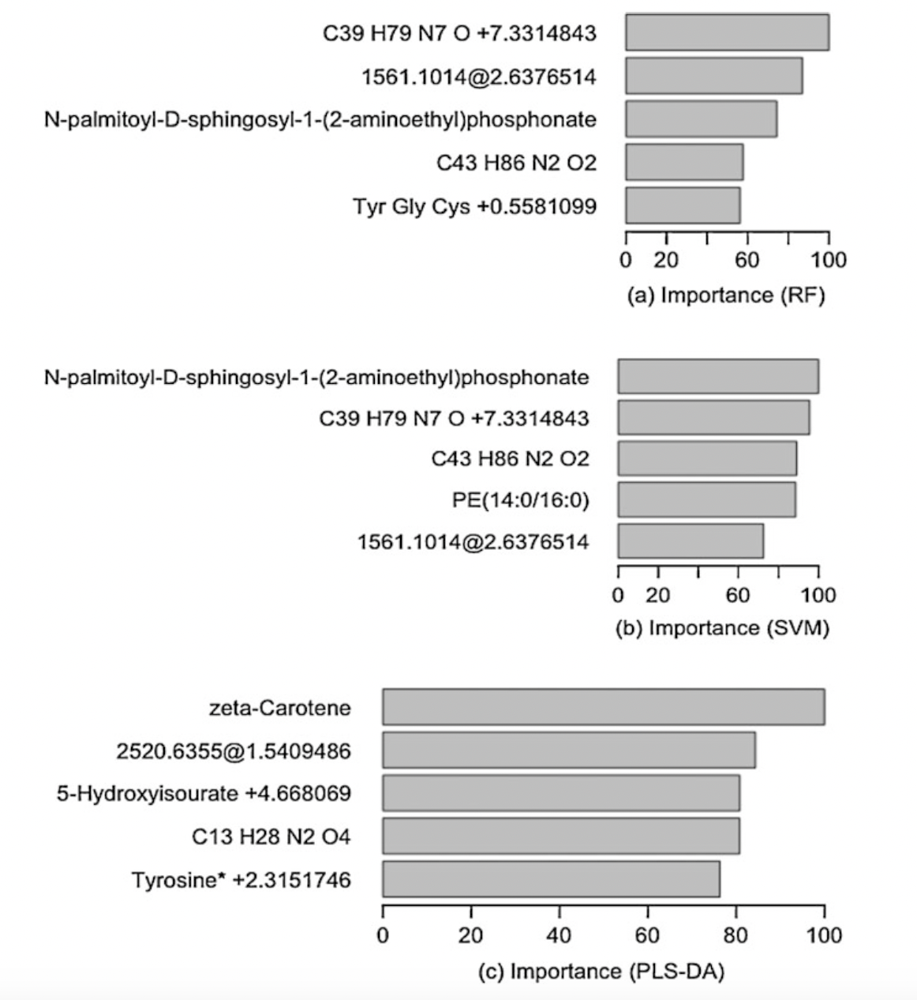
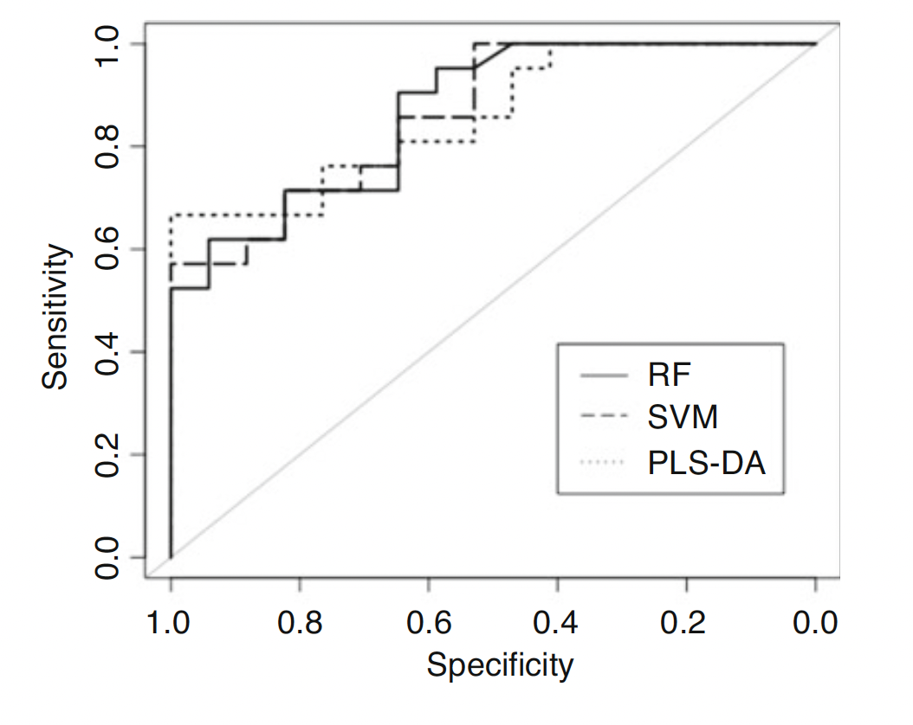
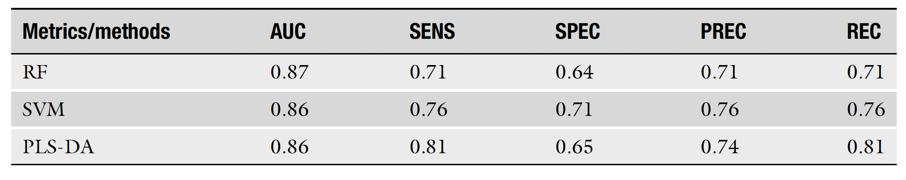

<style type="text/css">
.remark-slide-content {
    font-size: 22px;
    padding: 1em 4em 1em 4em;
}
.left-code {
  color: #777;
  width: 38%;
  height: 92%;
  float: left;
}
.right-plot {
  width: 60%;
  float: right;
  padding-left: 1%;
}
</style>

```{r setup, include=FALSE}
options(htmltools.dir.version = FALSE, echo=FALSE,
        message=FALSE,warning=FALSE,
        fig.dim=c(4.8, 4.5), fig.retina=2, out.width="100%")

knitr::opts_chunk$set(echo = FALSE)

knitr::knit_hooks$set(mysize = function(before, options, envir) {
  if (before) 
    return(options$size)
})
```

# Outline

.columnwide[
  ### 1) [An Illustrative Example](#Example)
  ### 2) [References and Resources](#Resources)
]

---

class: inverse, middle, center

name: Example

# An Illustrative Example
---

# Data (1)

- LC-MS metabolomics dataset from [www.metabolomicsworkbench.org](https://www.metabolomicsworkbench.org) (Project ID: PR00038)

- Plasma from 131 subjects was collected from the Chronic Obstructive Pulmonary Disease Gene study (COPDGene) study cohort and analyzed using untargeted LC-MS (C18+ and HILIC+) metabolomics.

- Data were annotated, normalized and preprocessed using the methods described in:
  - Cruickshank-Quinn CI, Jacobson S, Hughes G, Powell RL, Petrache I, Kechris K, Bowler R, Reisdorph N (2018) Metabolomics and transcriptomics pathway approach reveals outcome-specific perturbations in COPD. Sci Rep 8(1):17132
  - Regan EA, Hokanson JE, Murphy JR, Make B, Lynch DA, Beaty TH, Curran-Everett D, Silverman EK, Crapo JD (2010) Genetic epidemiology of COPD (COPDGene) study design. COPD 7(1):32–43. [https://doi.org/10.3109/15412550903499522](https://doi.org/10.3109/15412550903499522)

---

# Data (2)

- COPD is an extremely heterogeneous disease comprising **multiple phenotypes**.

- The **131 subjects** were either current or former smokers with various chronic obstructive pulmonary disease (COPD) phenotypes including airflow obstruction, radiologic emphysema, and exacerbations. 

- Within this set there were **56 males and 75 females**.

- **2999 metabolites**

---

# Training and test sets

- **70% training** (93 samples)

  Fivefold CV: 5 different subsets (or fivefolds)
  
    - 4 fold for training
    - 1 fold as holdout-test dataset
  
  The algorithms were trained against each of the folds.  
  The metrics were computed (average over fivefolds) for the training dataset.

- **30% test** (38 samples)

  The test dataset was used to provide an **unbiased evaluation** of the best model fit on the training dataset.  
  
  For **model validation**, the performance of the test data was predicted using the trained models for three classifiers.
  
---

# Implementing the predictive models

- Different predictive models were implemented based on the training dataset using:
  - metabolite abundances as the **predictor variables**
  - Gender (Male/Female) as the **response**
  
- Then, the **Variable Importance Score**, which is a measure of feature relevance to gender for each metabolite was computed.
---

# Feature Ranking and Variable Importance

.pull-left[

**Metabolite relevant feature ranking bar plots** (top five metabolites) using **Variable Important Scores** ranging from 0 to 100.

(a) Random Forest  
(b) Support Vector Machine (SVM)  
(c) Partial Least Square-Discriminant Analysis (PLS-DA) for the training dataset

]

.pull-right[

```{r out.width="100%", fig.align='center', fig.cap=''}

```
]

---

# Model Validation (1)

.pull-left[

**ROC curves** of the testing dataset obtained from three classification algorithms (RF, SVM, and PLS-DA)

]

.pull-right[

```{r out.width="100%", fig.align='center', fig.cap=''}

```

]

---

# Model Validation (2)

Metrics to evaluate the performance of classification on testing dataset:

- area under curve (AUC)
- sensitivity (SENS)
- specificity (SPEC)
- precision (PREC)
- recall (REC))

```{r out.width="100%", fig.align='center', fig.cap=''}

```

---

class: inverse, middle, center

name: Resources
  
# References and Resources

---

# Resources

- [Predictive Modeling for MetabolomicsData](https://www.researchgate.net/publication/338652670_Predictive_Modeling_for_Metabolomics_Data#fullTextFileContent) Tusharkanti Ghosh, Weiming Zhang, Debashis Ghosh, Katerina Kechris

- Metabolomics datasets: [www.metabolomicsworkbench.org](https://www.metabolomicsworkbench.org)

- [R code](https://metabolomics-data.github.io/)
